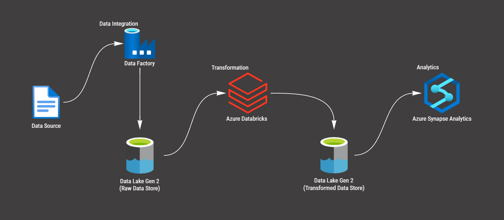

# Olympic_Analysis_Azure

In this project I'm going to use Azure Cloud (Azure Data Factory, Data Lake Gen 2, Synapse Analytics, Azure Databricks etc.) to build the data pipeline in order to Extract, Transform and Load (ETL) the data from 2021 Olympics in Tokyo.

## Built With
1. Data Source - 2021 Olympics in Tokyo dataset from kaggle
https://www.kaggle.com/datasets/arjunprasadsarkhel/2021-olympics-in-tokyo

2. Data Integration - Azure Data Factory

3. Raw Data Store - Azure Data Lake Gen 2

4. Data Transformation - Azure DataBricks

5. Transformed Data - Azure Data Lake Gen 2

6. Analytics - Azure Synapse Analytics

7. Visualization - PowerBI



## Objectives
- Query data from Amazon S3 with Amazon Athena and Trino SQL
- Create Visualizations using QuickSight

## Setting up an environment
Firstly, I opened AWS Console Home and searched for Athena


As well as created an instance


I found that AWS already provided me with a table


There was a lot of data
```sql
SELECT * FROM soccer_data
```


## SQL Queries
I wanted to run some queries to get meaningful insights from my data in order to use them in my visualization

- Average old age and young age in each team
```sql
WITH TeamAgeStats AS (
    SELECT team, 
           AVG(CASE WHEN age >= 30 THEN age END) AS avg_old_age,
           AVG(CASE WHEN age < 30 THEN age END) AS avg_young_age,
           AVG(age) AS avg_total_age
    FROM soccer_data
    GROUP BY team
)

SELECT team, 
       avg_old_age,
       avg_young_age,
       avg_total_age,
       CASE 
           WHEN avg_old_age < avg_young_age THEN 'Young Team'
           WHEN avg_old_age > avg_young_age THEN 'Old Team'
           ELSE 'Medium Team'
       END AS age_category
FROM TeamAgeStats;
```


- Find players with same skills, but different ratings
```sql
SELECT A.id AS player1_id, A.name AS player1_name, A.rating AS player1_rating,
       B.id AS player2_id, B.name AS player2_name, B.rating AS player2_rating
FROM soccer_data A
JOIN soccer_data B ON A.id < B.id
                  AND A.skill = B.skill
                  AND ABS(A.rating - B.rating) < 5;
```


- Finding range of skill in the teams
```sql
SELECT team, MAX(skill) - MIN(skill) AS skill_range
FROM soccer_data
GROUP BY team
ORDER BY skill_range DESC
LIMIT 5;
```


- Finding skill levels of top players in the teams
```sql
SELECT team, SUM(CASE WHEN rating >= 75 THEN skill ELSE 0 END) AS total_skill
FROM soccer_data
GROUP BY team
ORDER BY total_skill DESC;
```


-----------------------------------------------------------------------------------------
## Visualization
Then I prepared some visualizations to show my data using QuickSight. Here is one of those:


-----------------------------------------------------------------------------------------
## Summary
During this project I found meaningful insides that gave me information about sport teams and their performance. Simultaneously I have learnt a lot about AWS, as well as practiced SQL queries!

## Authors

- [@Szymon Poparda](https://www.linkedin.com/in/szymon-poparda-02b96a248/)


