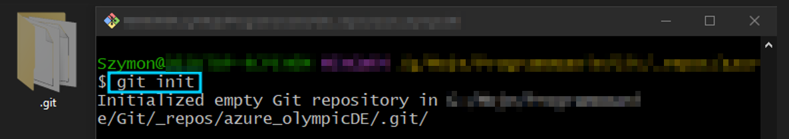
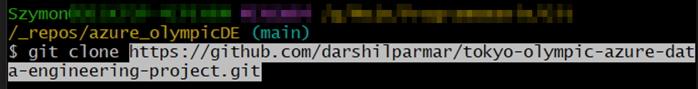
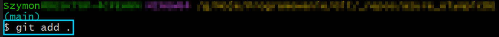
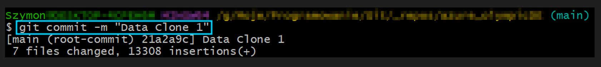
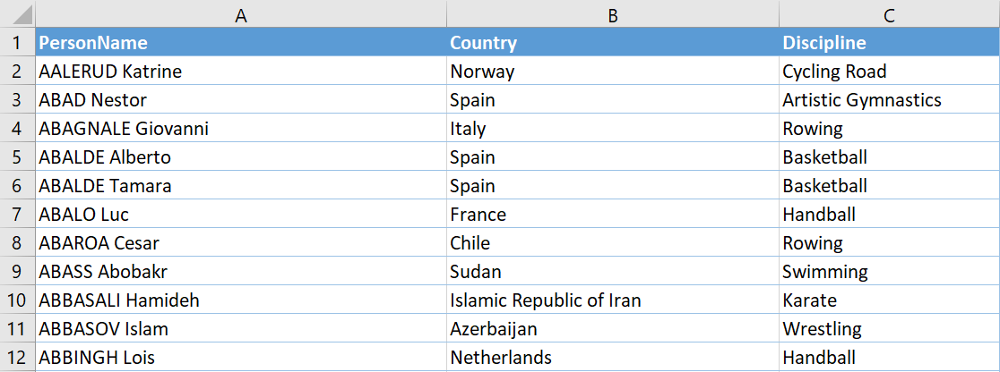

# Olympic_Analysis_Azure

In this project I'm going to use Azure Cloud (Azure Data Factory, Data Lake Gen 2, Azure Synapse Analytics, Azure Databricks etc.) to build the data pipeline in order to Extract, Transform and Load (ETL) the data from 2021 Olympics in Tokyo.

## Built With
1. Data Source - 2021 Olympics in Tokyo dataset

2. Data Integration - Azure Data Factory

3. Raw Data Store - Azure Data Lake Gen2

4. Data Transformation - Azure DataBricks (PySpark)

5. Transformed Data - Azure Data Lake Gen2

6. Analytics - Azure Synapse Analytics

7. Visualization - PowerBI

## Scenario
1. Copy raw data from data source to Azure Storage (Data Lake Gen2) using Azure Data Factory
2. Perform data transformation using Databricks (PySpark)
3. Upload transofrmed data to Azure Storage (Data Lake Gen2)
4. Understand the data in Azure Synapse Analytics using SQL queries
5. Visualize insights using PowerBI

## Data Source
The data for this project was provided by @darshilparmar on his GitHub (2021 Olympics in Tokyo)

In order to pull this data I used Git:
1. I initialized new repository

2. I cloned repository from GitHub using Git Bash

3. Added and commited changes

So in the end I was provided with 5 .csv files (Athletes, Coaches, EntriesGender, Medals, Teams)
Example: First rows of 'Athletes' table

## Execution
- Create Storage Account and Resource Group
zrob screeny jak tworzysz storage account

- Create container

- Create two directories inside the container: one storing raw data and one storing transformed data

- Create Data Factory

- Create pipeline (data-ingestion)
Copy every file from GitHub to Data Lake Gen 2 

- Create DataBricks Service
Create compute, create notebook,
mount storage account to databricks - app registration (create app), 
application client ID - 
Directory tenant ID -
SecretKey - (Create client secret)

provide permissions

- Create KeyVault

- Databricks trasnformation
load files, column name, change data types etc.

- Create Synapse analytics workspace
Lake Database

- Save As Images and add to PowerBI

-----------------------------------------------------------------------------------------
## Summary
During this project I found meaningful insides that gave me information about sport teams and their performance. Simultaneously I have learnt a lot about AWS, as well as practiced SQL queries!

## Authors

- [@Szymon Poparda](https://www.linkedin.com/in/szymon-poparda-02b96a248/)

