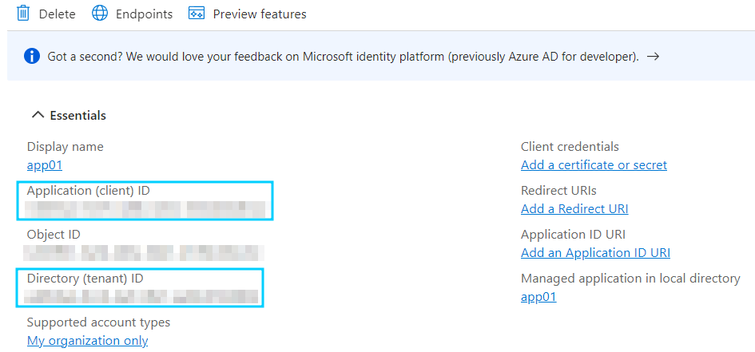
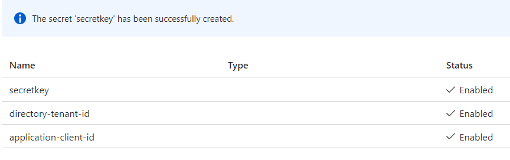
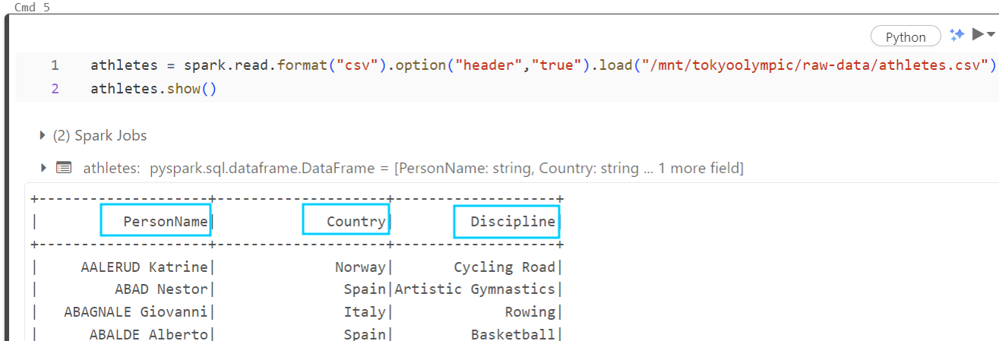

# Olympic_Analysis_Azure

In this project I'm going to use Git, as well as Azure Cloud (Azure Data Factory, Data Lake Gen 2, Azure Synapse Analytics, Azure Databricks etc.) to build the data pipeline in order to Extract, Transform and Load (ETL) the data from 2021 Olympics in Tokyo.

<details>
  <summary>Table of Contents</summary>
  <ol>
    <li>
      <a href="#built-with">Built With</a>
      <ul>
        <li><a href="#built-with">Built With</a></li>
      </ul>
    </li>
    <li>
      <a href="#getting-started">Getting Started</a>
      <ul>
        <li><a href="#prerequisites">Prerequisites</a></li>
        <li><a href="#installation">Installation</a></li>
      </ul>
    </li>
    <li><a href="#usage">Usage</a></li>
    <li><a href="#roadmap">Roadmap</a></li>
    <li><a href="#contributing">Contributing</a></li>
    <li><a href="#license">License</a></li>
    <li><a href="#contact">Contact</a></li>
    <li><a href="#acknowledgments">Acknowledgments</a></li>
  </ol>
</details>

-----------------------------------------------------------------------------------------

## Built With
1. Data Source - 2021 Olympics in Tokyo dataset (from GitHub)

2. Data Extraction - Git Bash

3. Data Integration - Azure Data Factory

4. Raw Data Store - Azure Data Lake Gen2

5. Data Transformation - Azure DataBricks (PySpark)

6. Transformed Data - Azure Data Lake Gen2

7. Analytics - Azure Synapse Analytics


-----------------------------------------------------------------------------------------

## Scenario
1. Extract Data using Git Bash
   
2. Copy raw data to Azure Storage (Data Lake Gen2) using Azure Data Factory
   
3. Perform data transformation using Databricks (PySpark)
   
4. Upload transofrmed data to Azure Storage (Data Lake Gen2)
   
5. Understand the data in Azure Synapse Analytics using SQL queries


-----------------------------------------------------------------------------------------

## Data Source
The data for this project was provided by @darshilparmar on his GitHub (2021 Olympics in Tokyo)

In order to pull this data I used Git Bash:
1. I initialized new repository


2. I cloned repository from GitHub using Git Bash


3. Added and commited changes
   


After this proccess I ended up with 5 .csv files (Athletes, Coaches, EntriesGender, Medals, Teams)

Demo: First rows of 'Athletes' table


4. Then I put this data on my private GitHub in order to later access it on Azure Portal


-----------------------------------------------------------------------------------------

## Execution
### Storage Account and Resource Group

- Create Storage Account and Resource Group
  


NOTE: Enable Hierarchical Namespace to gain folder-like structure


- Create container inside the Storage Account


- Create two directories inside the container: one for storing raw data and one for transformed data
  


### Data Factory
- Create Data Factory
  


- Create pipeline, which will copy the data from my private GitHub to Data Lake Gen2
1. Data Source: 


I had to connected my GitHub repository with a Linked Service, which is "like connection strings, which define the connection information needed for the service to connect to external resources"


2. Sink:


I repeated the same process for the rest of the files


### Data Bricks
- Set up the environment

1. Create DataBricks Service


2. Create compute
   


3. Register application to connect Azure Data Lake Storage Gen2 and DataBricks, using Application (client) ID and Directory (tenant) ID



- Key Vault
In order to protect sensitive data from being exposed in the code I decided to use the Keyvault


I faced an error: "The operation is not allowed by RBAC. If role assignments were recently changed, please wait several minutes for role assignments to become effective." 
Solution: to assign "Key Vault Secrets Officer" role to my account


Now I could create secrets




Then I wanted to create Secret Scope in Databricks


NOTE: from Microsoft documentation

I pasted my Databricks instance name inside this URL


Which took me to this page:


I provided neccesary information


So I wanted use this in the Notebooks


NOTE: from Microsoft documentation

I also faced an error this time: "Status code 403: Caller is not authorized to perform action on resource"
Solution: assign 'Key Vault Secret User' role


Now I could access my secrets


- Data Transformation
I configured databricks to access neccesaryy files using secrets from the KeyVault


```python
configs = {"fs.azure.account.auth.type": "OAuth",
"fs.azure.account.oauth.provider.type": "org.apache.hadoop.fs.azurebfs.oauth2.ClientCredsTokenProvider",
"fs.azure.account.oauth2.client.id": application_client_id,
"fs.azure.account.oauth2.client.secret": secretkey,
"fs.azure.account.oauth2.client.endpoint": f"https://login.microsoftonline.com/{directory_tenant_id}/oauth2/token"}

dbutils.fs.mount(
source = "abfss://tokyo-olympic-data@tokyoolympicdatamaple.dfs.core.windows.net",
mount_point = "/mnt/tokyoolympic",
extra_configs = configs)
```

NOTE: I faced an error - "This request is not authorized to perform this operation using this permission."
Solution: assign 'Storage Blob Data Contributor' role


Now I got access to my container


I started laoding my data. PySpark didn't include header


So I set "header" as true when loading



I also noticed that 'entiresgender' table had 'string' datatypes instead of 'integer', so  I fixed it. In order to do so I used built in AI assistant


I also wanted to play a little bit with the databricks so I answered to quesitons:

1. Find the top countries with the highest number of gold medals

```python
top_gold_medal_countries = medals.orderBy("Gold", ascending=False).select("Team_Country","Gold").show()
```


2. Calculate the average number of entries by gender for each discipline

```python
average_entries_by_gender = entriesgender.withColumn(
    'Avg_Female', entriesgender['Female'] / entriesgender['Total']
).withColumn(
    'Avg_Male', entriesgender['Male'] / entriesgender['Total']
)
average_entries_by_gender.show()
```


After the transformation I loaded the data into 'transformed-data' container


### Synapse Analytics
- Set up the environment
I faced an error when creating Synapse workspace:
"The Azure Synapse resource provider (Microsoft.Synapse) needs to be registered with the selected subscription."
Solution: register Synapse Analytics inside subscription tab


- Analytics
Once I had my Synapse Analytics workspace set up I created new database and loaded my data there


I ran a few SQL Queries to get insides from my data
```sql
-- Count the number of athletes from each country
WITH Coaches_Teams AS (
    SELECT c.Name, c.Country, c.Discipline, t.TeamName, t.Event
    FROM coaches AS c
    JOIN teams AS t ON c.Country = t.Country
) 
SELECT Country, COUNT(Event) as NumberOfEvents
FROM Coaches_Teams
GROUP BY Country
ORDER BY NumberOfEvents DESC;
```


```sql
-- Count the number of athletes from each country
SELECT Country, COUNT(*) as total_athletes
FROM athletes
GROUP BY Country
ORDER BY total_athletes DESC;
```


```sql
-- Calculate the total medals won by each country:
SELECT Team_Country, 
SUM(Gold) AS totalgold, 
SUM(Silver) as totalsilver, 
SUM(Bronze) as totalbronze,
SUM(Gold + Silver + Bronze) AS totalmedals
FROM medals
GROUP BY Team_Country
ORDER BY totalmedals DESC;
```


```sql
-- Calculate the average number of entries by gender for gymnastics
SELECT Discipline, 
AVG(Female) as Avg_Female,
AVG(Male) as Avg_Male
FROM entriesgender
WHERE Discipline LIKE '%Gymnastics%'
GROUP BY Discipline;
```


Synapse Analytics also automatically created charts based my the queries


-----------------------------------------------------------------------------------------
## Summary


## Authors

- [@Szymon Poparda](https://www.linkedin.com/in/szymon-poparda-02b96a248/)


